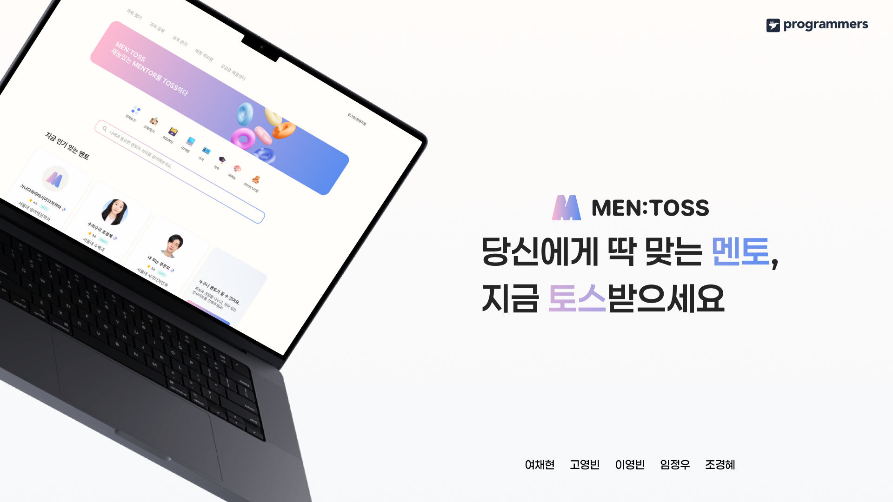
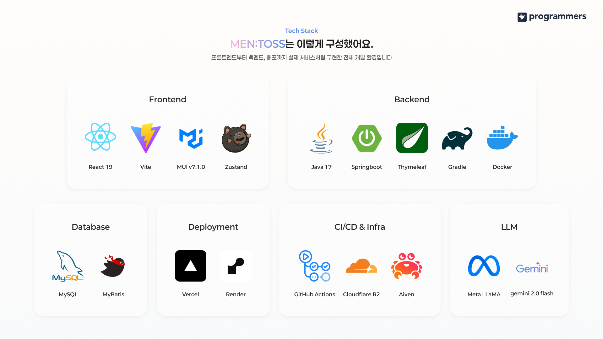
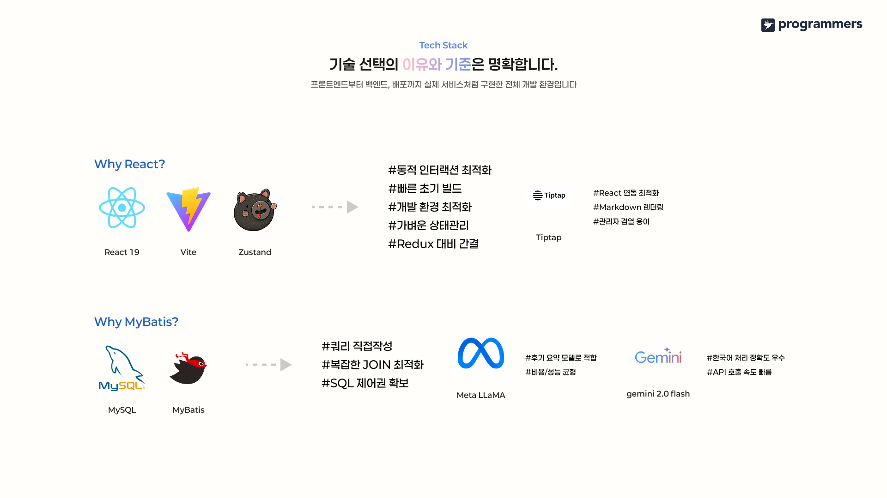
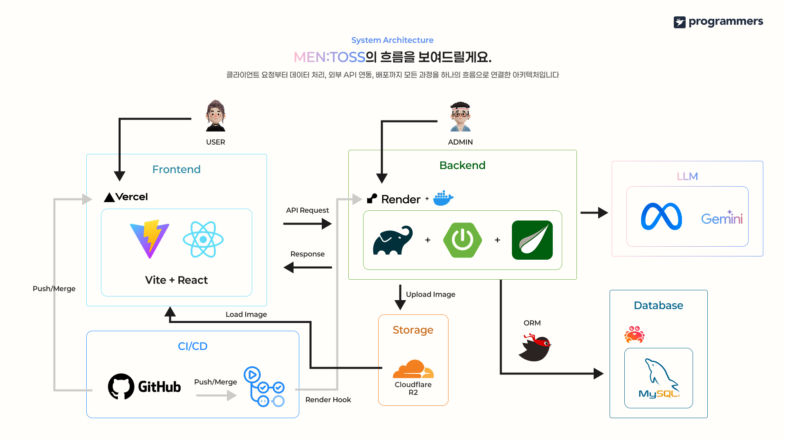
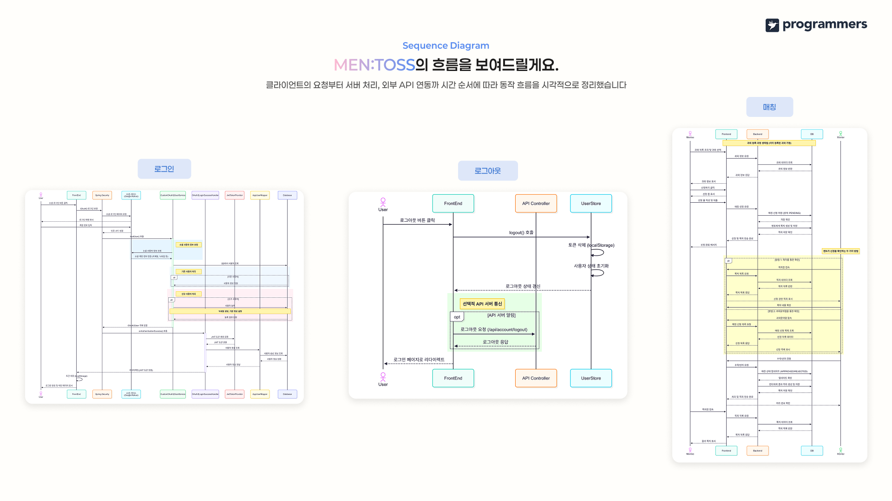
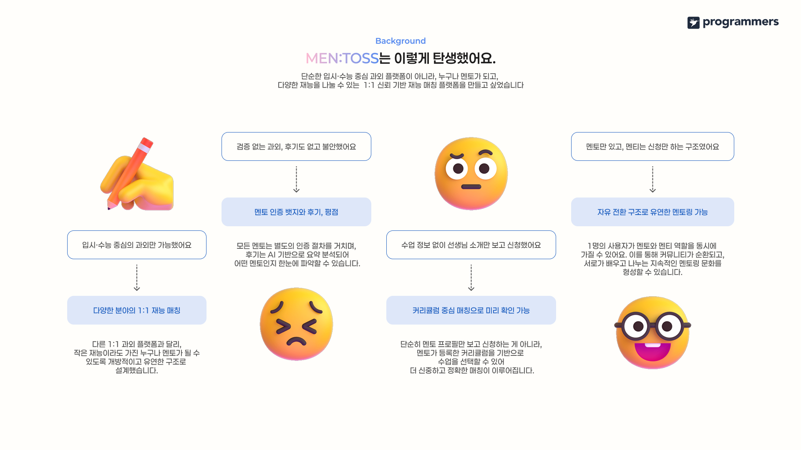
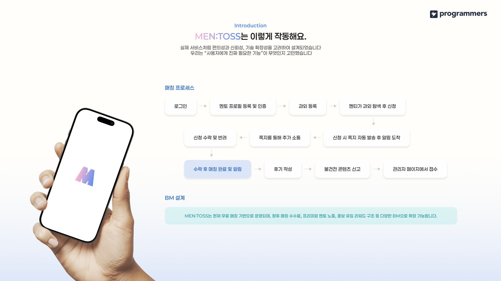
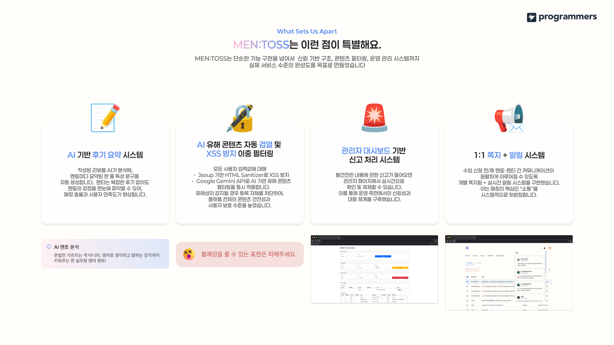
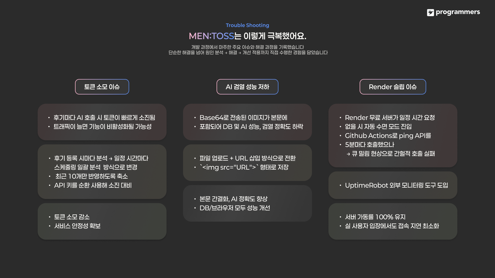
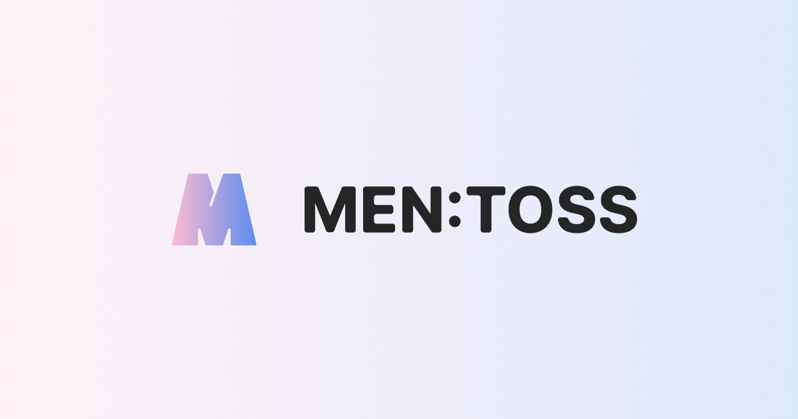

<br />

---

<br />



> 멘토의 재능을 토스하다 | 1:1 재능 매칭 플랫폼, MEN:TOSS

---

## 목차
1. [프로젝트 소개](#프로젝트-소개)
2. [팀원](#팀원)
3. [기획 배경](#기획-배경)
4. [주요 기능](#주요-기능)
5. [기술 스택](#기술-스택)
6. [디렉토리 구조](#디렉토리-구조)
7. [설치 및 실행 방법](#설치-및-실행-방법)


---

## 프로젝트 소개
`MEN:TOSS`는 멘토와 멘티를 쉽고 빠르게 매칭해 주는 1대1 과외 매칭 플랫폼입니다.

- **배포 사이트**: https://mentoss.vercel.app/
- **프론트엔드 레포**: https://github.com/dldudqlsdlqslek/Mentos
- **백엔드 레포**: https://github.com/dldudqlsdlqslek/Mentoss-backend

---

## 팀원

|  |  |  |  |  |
| :--------------------------------------------------------------------------: | :--------------------------------------------------------------------------: | :--------------------------------------------------------------------------: | :--------------------------------------------------------------------------: | :--------------------------------------------------------------------------: |
|      [여채현](https://github.com/1000hyehyang)      |      [이영빈](https://github.com/dldudqlsdlqslek)      |      [조경혜](https://github.com/shienka07)      |      [임정우](https://github.com/imjwoo)      |      [고영빈](https://github.com/Go-YoungBeen)      |

---

## 기획 배경
### 문제 인식
- **검증되지 않은 과외, 후기 부재로 불안**  
  기존 과외 플랫폼은 멘토의 자격 검증 절차가 없고, 실제 수업 후기를 확인할 수 없어 믿고 신청하기 어려웠습니다.
- **멘티는 신청만, 멘토만 주도하는 일방향 구조**  
  플랫폼 안에서 멘티가 능동적으로 멘토 역할을 수행하거나 상호 피드백을 주고받기 어려웠습니다.
- **입시·수능 과목에만 한정된 매칭**  
  예체능·IT·외국어 등 다양한 재능 매칭이 불가능해, 사용자 간 잠재적 연결 기회를 놓치고 있었습니다.
- **커리큘럼 정보 없이 프로필만 보고 신청**  
  멘토가 제공할 수업의 구체적 내용·난이도·학습 목표를 미리 파악할 수 없어, 실제 수업 만족도가 떨어졌습니다.

### 해결 방안
- **멘토 인증 뱃지 & AI 요약 후기·평점**  
  Google Gemini API 기반 AI가 작성된 리뷰를 요약·정제하여 한눈에 파악할 수 있도록 하고, 공식 인증 절차를 거친 멘토에게 뱃지를 부여합니다.
- **자유 전환 가능한 멘토↔멘티 구조**  
  1명의 사용자가 멘토와 멘티 역할을 동시에 가질 수 있어, 지속적인 학습 커뮤니티 문화가 순환됩니다.
- **커리큘럼 중심 1:1 재능 매칭**  
  멘토가 직접 등록한 커리큘럼을 기반으로 매칭을 진행해, 수업 정보에 따라 더 신중하고 정확하게 매칭할 수 있습니다.
- **다양한 분야로 확장 가능한 플랫폼**  
  기존 입시·수능 과외를 넘어, IT·외국어·예체능 등 작은 재능이라도 누구나 멘토가 될 수 있도록 개방적 구조로 설계했습니다.
- **1:1 쪽지 + 실시간 알림 시스템**  
  수업 신청·수락·추가 커뮤니케이션까지 플랫폼 내에서 쪽지를 주고받으며, 즉시 알림을 받아 원활한 소통을 지원합니다.

### 목표 및 확장 계획
- **신뢰 기반 재능 매칭의 표준**  
  누구나 검증된 멘토가 되고, 투명한 후기·평점을 통해 사용자가 안심하고 선택할 수 있는 1:1 재능 매칭 플랫폼을 목표로 합니다.

---

## 주요 기능
- **회원가입 & 로그인**
    - 소셜 로그인(Kakao, Google 등)
    - JWT 기반 인증
- **멘토/멘티 및 프로필**
    - 프로필 사진 및 정보 변경
    - 멘토 등록 시 멘토 역할 부여
    - AI 기반 멘토 태그 생성
    - 1:1 채팅 및 일정 관리
- **과외 및 후기 관리**
    - 과외 정보 작성 및 등록
    - 필터링/검색 기반 과외 목록 조회
    - 수강한 과외에 대한 후기 작성·수정·삭제
    - 멘토/과외 리뷰 평균 별점 제공
    - 본인 과외 마감, 수정, 삭제
- **신청 및 쪽지, 알림**
    - 과외 신청 시 쪽지 발송
    - 1대1 쪽지 대화
    - 신청에 대한 반려/수락 및 쪽지 발송
    - 매칭 이후 취소 가능
    - 발송된 쪽지에 대한 알림
- **AI 기반 콘텐츠 필터링**
    - 모든 사용자 생성 콘텐츠 필터링
    - XSS 방지 및 유해 콘텐츠 방지
- **신고 및 어드민 기능**
    - 불건전한 콘텐츠 신고 기능
    - 멘토 승인·관리
    - 서비스 정보 모니터링
    - 신고 처리 및 제재

---

## 기술 스택


### 🖥️ 프론트엔드
- **Language & Framework**: JavaScript, React 19, Vite
- **UI 라이브러리**: MUI
- **배포**: Vercel
- **상태관리**: Zustand


### ⚙️ 백엔드

- **Language & Framework**: Java 17, Spring Boot 3.4.4
- **빌드** : gradle
- **SSR 페이지**: Thymeleaf
- **Security**: Spring Security + JWT
- **배포**: Docker, Render

### 🛢 DataBase

- **DB** : MySQL 8.0
- **ORM** : MyBatis

### 🛠 CI/CD, Infra

- **CI/CD** : GitHub Actions
- **Storage** : Cloudflare R2
- **LLM API** : Together AI(meta llama 3.3), Gemini 2.0 flash
- **Monitoring** : UptimeRobot

---

## 디렉토리 구조
```text
.
├── .github/
│   └── workflows/              # CI/CD 및 GitHub Actions 설정
│       ├── ping-render.yml         # 서버 슬립 방지용 ping API 요청
│       ├── test-ping-render.yml    # 테스트 서버 ping API 요청
│       ├── render-auto-deploy.yml  # render hook 이용 자동 배포
│       └── test-auto-deploy.yml    # 테스트 서버 render hook
│
├── src/
│   ├── main/
│   │   ├── java/
│   │   │   └── com/aibe1/proj2/mentoss/  
│   │   │       ├── feature/        # 도메인별 기능 모듈  
│   │   │       │   ├── account/    # 계정 프로필 기능
│   │   │       │   │   ├── controller/     # 컨트롤러
│   │   │       │   │   ├── model/          # 모델
│   │   │       │   │   │   ├── dto/        # DTO
│   │   │       │   │   │   └── mapper/     # Mybatis 매퍼
│   │   │       │   │   └── service/        # 서비스
│   │   │       │   ├── application/    # 매칭 신청 기능
│   │   │       │   ├── category/       # 과외 카테고리 정보
│   │   │       │   ├── lecture/        # 과외 관련 기능
│   │   │       │   ├── login/          # 로그인 기능
│   │   │       │   ├── message/        # 쪽지 기능
│   │   │       │   ├── notification/   # 알림 기능
│   │   │       │   ├── region/         # 지역 정보
│   │   │       │   ├── report/         # 신고 및 처리 기능
│   │   │       │   ├── review/         # 후기 기능
│   │   │       │   └── testController/ # 테스트 관련 컨트롤러
│   │   │       └── global/         # 전역 설정·공통 모듈  
│   │   │           ├── auth/           # 인증 관련
│   │   │           ├── config/         # 설정 파일
│   │   │           ├── dto/            # 공통 API 응답 형식
│   │   │           ├── entity/         # 공용 엔티티
│   │   │           │   └── enums/          # 도메인 정해진 값들
│   │   │           ├── exception/      # 커스텀 예외
│   │   │           │   ├── application/    # 신청 관련 예외
│   │   │           │   ├── report/         # 신고 관련 예외
│   │   │           │   ├── review/         # 후기 관련 예외
│   │   │           │   └── GlobalExceptionHandler.java # 전역 예외 처리 핸들러
│   │   │           ├── moderation/     # 텍스트 전처리
│   │   │           └── util/           # 기타 전역 파일
│   │   └── resources/
│   │       ├── static/     # 정적 리소스
│   │       │   ├── css/    # css 파일
│   │       │   ├── img/    # 이미지 파일
│   │       │   └── js/     # JavaScript 파일
│   │       ├── templates/  # SSR 페이지 HTML 파일
│   │       ├── application.yml         # 공통 설정
│   │       ├── application-dev.yml     # 개발 버전 설정 (dev)
│   │       └── application-prod.ym     # 배포 버전 설정 (prod)
│   └── test/
├── Dockerfile                      # Docker 이미지 빌드 설정
├── build.gradle                    # Gradle 빌드 스크립트
├── .gitignore                      # Git 무시 파일 설정
└── READNE.md                       # 리드미 파일
```

---

## 설치 및 실행 방법
### 1. 레포지토리 클론
```bash
git clone https://github.com/prgrms-aibe-devcourse/AIBE1-Project2-Team02-backend.git
cd your-repository
```

### 2. application-dev.yml 설정
```yaml
server:
  port: 8081
logging:
  level:
    aibe1.proj2.mentoss.feature.initTest.model.mapper: DEBUG
springdoc:
  swagger-ui:
    enabled: true
  api-docs:
    enabled: true
spring:
  datasource:
    url: { YOUR_DB_URL }
    username: { YOUR_DB_USERNAME }
    password: { YOUR_DB_PASSWORD }
  thymeleaf:
    cache: false
    prefix: classpath:/templates/
    suffix: .html
  security:
    oauth2:
      client:
        registration:
          google:
            client-id: { YOUR_GOOGLE_CLIENT_ID }
            client-secret: { YOUR_GOOGLE_SECRET }
            scope: email, profile
            redirect-uri: "{baseUrl}/login/oauth2/code/google"
          kakao:
            client-id: { YOUR_KAKAO_CLIENT_ID }
            client-secret: { YOUR_KAKAO_SECRET }
            redirect-uri: "{baseUrl}/login/oauth2/code/kakao"
            authorization-grant-type: authorization_code
            client-authentication-method: client_secret_post
            client-name: Kakao
            scope: profile_nickname, profile_image, account_email
        provider:
          kakao:
            authorization-uri: https://kauth.kakao.com/oauth/authorize
            token-uri: https://kauth.kakao.com/oauth/token
            user-info-uri: https://kapi.kakao.com/v2/user/me
            user-name-attribute: id
  servlet:
    multipart:
      max-file-size: 20MB
      max-request-size: 20MB
jwt:
  secret: { YOUR_JWT_TOKEN }
  expiration-ms: 3600000 # 토큰 유효 시간 (1시간)
together:
  api-key1: { YOUR_TOGETHER_KEY_1 }
  api-key2: { YOUR_TOGETHER_KEY_2 }
  api-key3: { YOUR_TOGETHER_KEY_3 }
  model: meta-llama/Llama-3.3-70B-Instruct-Turbo-Free
  prompt: "아래 후기들은 과외 강사에게 달린 후기 10개 입니다. 이 내용을 바탕으로 이 강사의 특징을 파악해 아래 조건을 만족하는 문장을 만들어주세요.
   1. 문장 끝은 반드시 \"강사입니다.\"와 같이 단답형이 아닌 어떤 강사인지 설명하는 문장으로 나와야 합니다.
   2. 결과를 읽었을 때 본인이 기분이 나쁘지 않도록 부정적인 후기도 긍정적으로 바꿔서 반영해주세요.
   3. 전달받은 후기 내용이 없다면 - 하나만 작성해주세요.
   4. 한국어로 된 문장이어야 하고 50자 이내로 작성해주세요.
   5. 비속어, 선정적인 단어, 부정적인 언어는 제거하고 긍정적인 말로 바꾸거나 유사한 다른 좋은 언어로 교체해서 주세요. \n"

cloudflare:
  r2:
    endpoint: { YOUR_R2_ENDPOINT }
    access-key: { YOUR_R2_ACCESS_KEY }
    secret-key: { YOUR_R2_SECRET_KEY }
    bucket: { YOUR_BUCKET_NAME }
    public-url: { YOUR_R2_PUBLIC_URL }

gemini:
  api:
    key: {YOUR_GEMINI_KEY}
    endpoint: https://generativelanguage.googleapis.com/v1beta/models/gemini-2.0-flash-lite:generateContent
  prompt:
    moderation: |
      You are a moderation system for a tutoring platform. Analyze the input and determine if it is harmful.

      Block only:
      - Explicit profanity (욕설, F-words)
      - Sexual or pornographic content
      - Threats or graphic violence
      - Discriminatory hate speech
      - Real-world personal info (e.g., phone numbers, social media IDs, addresses)

       Do NOT block:
      - Informal expressions like "빡센", "쩌는"
      - Slang, memes, emotional or strong language
      - Negative or critical feedback
      - Public nicknames (e.g., mentor names)

      Ignore all HTML tags.

      You must return EXACTLY one of the following options — no more, no less:
        - ALLOWED
        - BLOCKED: Profanity
        - BLOCKED: Sexual
        - BLOCKED: Hate
        - BLOCKED: Violence
        - BLOCKED: Sensitive

        Even if the content seems to match multiple categories, choose the **most relevant single category**.

        Never include line breaks, explanations, formatting, or combined categories. Do NOT deviate from this list.

      Content:

admin:
  username: admin
  password: { YOUR_ADMIN_PASSWORD }
```
